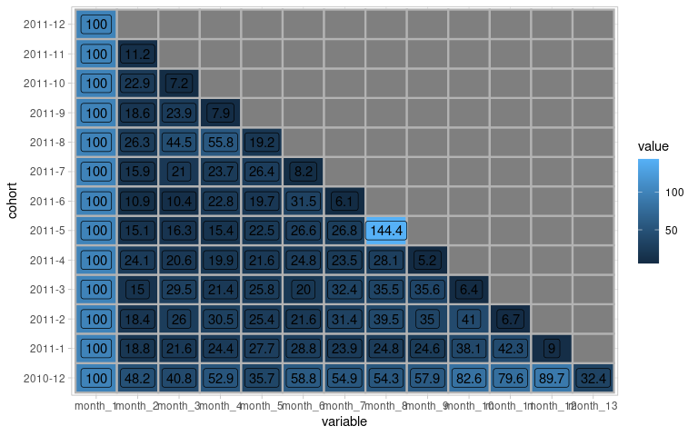

<!-- README.md is generated from README.Rmd. Please edit that file -->

# rcohort

<!-- badges: start -->

[](https://github.com/vohai611/rcohort/actions)
[](https://app.codecov.io/gh/vohai611/rcohort?branch=master)
<!-- badges: end -->

The goal of `rcohort` is to perform cohort analysis with R. This package
build on top of `data.table` hence it should bring good speed!

## Installation

`rcohort` use `data.table` version 1.14.3, which is not available on
CRAN yet. Therefore, you need to update `data.table` to the development
version first to be able to use `rcohort`. You can install the
development version of `rcohort` from
[GitHub](https://github.com/vohai611/rcohort) with:

``` r
# install.packages("devtools")
data.table::update.dev.pkg()
devtools::install_github("vohai611/rcohort")
```

## Example

This is a basic example which shows you how to execute cohort analysis
with `rcohort`

``` r
df = readRDS("example-data/online-retail.rds")
```

This is a typical dataset of an online retailer
([Source](https://archive.ics.uci.edu/ml/datasets/Online+Retail#))

``` r
head(df)
```

    #>   InvoiceNo StockCode                         Description Quantity
    #> 1    536365    85123A  WHITE HANGING HEART T-LIGHT HOLDER        6
    #> 2    536365     71053                 WHITE METAL LANTERN        6
    #> 3    536365    84406B      CREAM CUPID HEARTS COAT HANGER        8
    #> 4    536365    84029G KNITTED UNION FLAG HOT WATER BOTTLE        6
    #> 5    536365    84029E      RED WOOLLY HOTTIE WHITE HEART.        6
    #> 6    536365     22752        SET 7 BABUSHKA NESTING BOXES        2
    #>           InvoiceDate UnitPrice CustomerID        Country
    #> 1 2010-12-01 08:26:00      2.55      17850 United Kingdom
    #> 2 2010-12-01 08:26:00      3.39      17850 United Kingdom
    #> 3 2010-12-01 08:26:00      2.75      17850 United Kingdom
    #> 4 2010-12-01 08:26:00      3.39      17850 United Kingdom
    #> 5 2010-12-01 08:26:00      3.39      17850 United Kingdom
    #> 6 2010-12-01 08:26:00      7.65      17850 United Kingdom

`cohort_count()` perform cohort analysis by counting the appearance of
customer in each time period. In particular, Customer are grouped by the
first time they appear in the dataset. We can choose the rounded time to
every “month”, “week”, “quarter” or “year”.

``` r
library(rcohort)

df1 = df |>
  cohort_count(.id_col = CustomerID,
               .time_col = InvoiceDate,
               time_unit = "month",
               percent_form = TRUE)
head(df1, 5)
```

    #>     cohort month_1  month_2  month_3  month_4  month_5  month_6  month_7
    #>     <fctr>   <num>    <num>    <num>    <num>    <num>    <num>    <num>
    #> 1: 2010-12     100 36.61017 32.31638 38.41808 36.27119 39.77401 36.27119
    #> 2:  2011-1     100 22.06235 26.61871 23.02158 32.13429 28.77698 24.70024
    #> 3:  2011-2     100 18.68421 18.68421 28.42105 27.10526 24.73684 25.26316
    #> 4:  2011-3     100 15.04425 25.22124 19.91150 22.34513 16.81416 26.76991
    #> 5:  2011-4     100 21.33333 20.33333 21.00000 19.66667 22.66667 21.66667
    #>     month_8   month_9  month_10  month_11 month_12 month_13
    #>       <num>     <num>     <num>     <num>    <num>    <num>
    #> 1: 34.91525 35.367232 39.548023 37.401130 50.28249 26.55367
    #> 2: 24.22062 29.976019 32.613909 36.450839 11.75060       NA
    #> 3: 27.89474 24.736842 30.526316  6.842105       NA       NA
    #> 4: 23.00885 27.876106  8.628319        NA       NA       NA
    #> 5: 26.00000  7.333333        NA        NA       NA       NA

To include group of all customer, use `all_group = TRUE`

``` r
df2 = df |>
  cohort_count(.id_col = CustomerID,
               .time_col = InvoiceDate,
               time_unit = "month",
               all_group = TRUE)
head(df2, 5)
```

    #>     cohort month_1  month_2  month_3  month_4  month_5  month_6  month_7
    #>     <fctr>   <num>    <num>    <num>    <num>    <num>    <num>    <num>
    #> 1:     All     100 22.49885 21.71508 21.36929 20.86215 20.23974 18.53389
    #> 2: 2010-12     100 36.61017 32.31638 38.41808 36.27119 39.77401 36.27119
    #> 3:  2011-1     100 22.06235 26.61871 23.02158 32.13429 28.77698 24.70024
    #> 4:  2011-2     100 18.68421 18.68421 28.42105 27.10526 24.73684 25.26316
    #> 5:  2011-3     100 15.04425 25.22124 19.91150 22.34513 16.81416 26.76991
    #>     month_8  month_9  month_10  month_11 month_12  month_13
    #>       <num>    <num>     <num>     <num>    <num>     <num>
    #> 1: 16.71277 15.67543 14.776395 11.733518 11.38774  5.417243
    #> 2: 34.91525 35.36723 39.548023 37.401130 50.28249 26.553672
    #> 3: 24.22062 29.97602 32.613909 36.450839 11.75060        NA
    #> 4: 27.89474 24.73684 30.526316  6.842105       NA        NA
    #> 5: 23.00885 27.87611  8.628319        NA       NA        NA

Beside counting the appearance of customers, you can summarise cohort
performance over time. For example, we can observe the change of the
revenue over time.

``` r
df$Revenue = df$Quantity * df$UnitPrice

cohort_df = df |> 
  cohort_summarise(.id_col = CustomerID,
                   .time_col = InvoiceDate,
                  .summarise_col = Revenue,.fn = "sum", time_unit = "month",
                  percent_form = TRUE) 

head(cohort_df,5)
```

    #>     cohort month_1  month_2  month_3  month_4  month_5  month_6  month_7
    #>     <fctr>   <num>    <num>    <num>    <num>    <num>    <num>    <num>
    #> 1: 2010-12     100 48.23310 40.83110 52.92684 35.69106 58.77760 54.85507
    #> 2:  2011-1     100 18.80918 21.57796 24.41528 27.66441 28.84777 23.91052
    #> 3:  2011-2     100 18.36528 26.01103 30.50350 25.38724 21.64081 31.43163
    #> 4:  2011-3     100 15.02446 29.51843 21.40082 25.81963 20.00341 32.44839
    #> 5:  2011-4     100 24.13938 20.55304 19.92556 21.56698 24.75693 23.49695
    #>     month_8  month_9 month_10  month_11  month_12 month_13
    #>       <num>    <num>    <num>     <num>     <num>    <num>
    #> 1: 54.26513 57.92582 82.55669 79.634983 89.713834 32.44257
    #> 2: 24.79123 24.56407 38.13134 42.250680  9.025974       NA
    #> 3: 39.49033 35.01918 40.98179  6.702973        NA       NA
    #> 4: 35.49956 35.62045  6.43176        NA        NA       NA
    #> 5: 28.05360  5.20451       NA        NA        NA       NA

We can also quick visualize cohort data by calling `auto_plot`

``` r
cohort_df |> auto_plot("tile")
```


